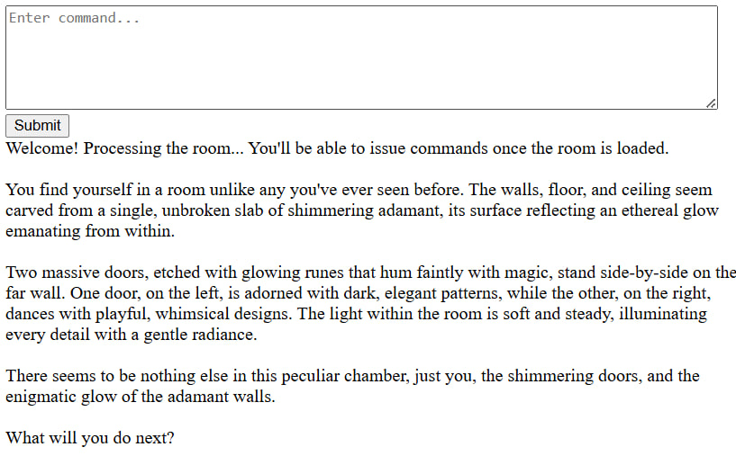

# Welcome

To AI puzzle rooms repo. Currently, only local running is supported. Here is an example of what you might expect once the game is loaded:




# Instructions to run

Make sure you have `ollama serve`running.

Clone this repo

run these lines or similar:
```
python -m venv ai_puzzle_rooms_venv
source ai_puzzle_rooms_venv/bin/activate
cd AI_puzzle_rooms
pip install -r requirements.txt
```

Then
```
python server.py 8081
```

And open your browser to http://localhost:8081

The easiest way to restart a game for now is by restarting the server.

# Hardware requirements

At least a 3090, not only because of the VRAM required, but also because the AI takes time to process each turn of the game.
