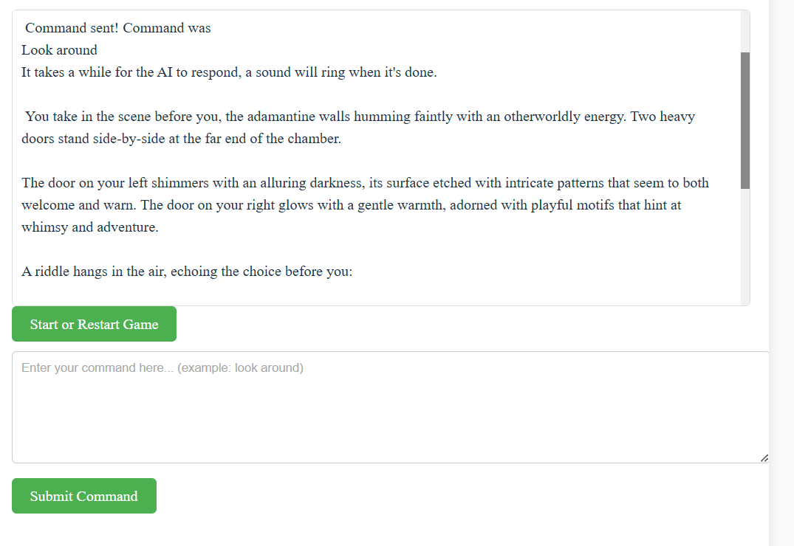

# Welcome!

This repository is about an "escape the room" text adventure game. It allows for freeform text input "do a backflip"; "summon a dragon", though not all actions are permitted by the game (you might get injured by the backflip and the summoning attempt may fail if you can't use magic)

The idea is to interact with the contents of the room in creative ways in order to fulfill the escape conditions!

The game runs at https://rodmel.me if you want to try it out. Caveat: the system takes long to process each turn.

## Game screenshot


## How to run the Main server

If you want to run your copy of the game, you need to run both the Main and the Game servers. They're split because the Game server can be run on a local GPU (not mandatory), while the Main server can run on a regular webserver.

To compile the frontend, clone the repo and:

```
cd AI_puzzle_rooms/Main/text-puzzles-frontend
npm install
npm run build
cp -r dist/* ../text-puzzles-backend/static/
```

To run the backend, export the following environment variables:
```
FRONTEND_CORS_IP= the ip of the webserver
VITE_REACT_APP_BACKEND_URL=the ip from which the backend of the webserver will run (same ip as the webserver, usually)
VITE_REACT_APP_BACKEND_PORT=the port from which the backend of the webserver will run
MAIN_SERVER_PORT_NUMBER= again, the port from which the backend of the webserver will run
SSL_KEYFILE_PATH= the ssl keyfile for https serving (if you don't have one, you need to deal with CORS)
SSL_CERTFILE_PATH= the ssl certfile for https serving (if you don't have one, you need to deal with CORS)
VITE_APP_TITLE="AI-rooms"
GAME_SERVER_IP= the ip of the game server (this may be in another machine)
GAME_SERVER_PORT_NUMBER=the port which you will open on the game server
```

Then:
```
cd AI_puzzle_rooms/Main/text-puzzles-backend
pip install
python server.py
```
(you may need to run the last line with `sudo env $(cat ../.env | xargs) PATH=$PATH python server.py` if serving through a port under number 1024, as is the case with https)

## How to run the Game server
You can run the game server locally with Ollama or through an external API such as DeepInfra.

To run locally, make sure you have ollama running with `ollama serve`. Then, 
```
cd AI_puzzle_rooms/Game/text-puzzles-game
chmod +x ./ollama/start_ollama.sh
./start_ollama.sh
```
Then export these environment variables
```
MAIN_SERVER_IP=the ip of the webserver for CORS reasons
GAME_SERVER_PORT_NUMBER= the port you want to open in the game server
USE_EXTERNAL_BACKBONE=False
```

If running through an external API, export these:
```
MAIN_SERVER_IP=the ip of the webserver for CORS reasons
GAME_SERVER_PORT_NUMBER= the port you want to open in the game server
OPEN_API_KEY=your llm service API key
OPEN_API_URL=your llm service URL
USE_EXTERNAL_BACKBONE=True
```

Then, finally, in the Game/text-puzzles-game folder,
```
python server.py
```
